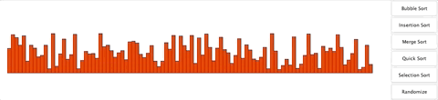
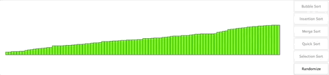
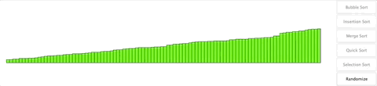
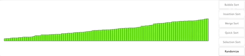
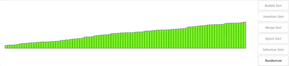
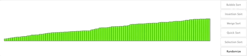

# Sorting Algorithm Visualizer
### Description
Besides Conway's game of life, algorithm visualizers were something I always wanted to create. For this project, I decided to create/visualize the five most common sorting algorithms (Bubble sort, Insertion sort, Merge sort, Quick sort and Selection sort). 

Of the five sorting algorithms, merge sort and quick sort were the hardest to visualize (they were too fast for the gui to draw periodically). In order to resolve this issue, a new thread was created for each sort with delays inside those threads. These new threads and their delays made drawing the steps of the two sorting algorithms visible.

I had a lot of fun with this project and I was happy to finally use the sorting alogorithms I've learned, even if it is just for a project on visualizing said algorithms.

Below are gifs of all the algorithms and the sorting button. Please note, the sorting algorithms have different time steps. The time steps vary based on the visibilty of seeing the steps/algorithms.

### Bubble Sort

### Insertion Sort

### Merge Sort

### Quick Sort

### Selection Sort

### Randomize

